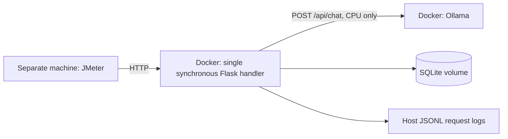

# Member 1 handoff

## Baseline architecture

Only `POST /tickets` inserts a ticket. The handler calls Ollama, validates its
completed category response, writes SQLite, and returns the result in that order.
`GET /search` scans stored narratives for a literal, case-sensitive substring.
`GET /stats` counts stored tickets by category. There are no application caches,
background jobs, bulk imports, or application job queues. The server handles
one request at a time; socket waiting and Ollama's own runtime behavior remain
part of the system under test.

## Interfaces for teammates

- Members 2 and 3: independently label the allocated Group 10 rows 10000–10999.
  This implementation does not generate golden labels or accept raw source labels
  as correct answers.
- Member 4: choose and freeze 3–5 model candidates spanning at least two size
  classes. Record exact tag, full digest, prompt, inference settings, and model
  licence. The default `qwen3:0.6b` is only a connection-check choice. No accuracy
  conclusion follows from its successful response.
- Member 5: use the JSON request contract in the README from a separate machine.
  Preserve `X-Request-ID` in client evidence for correlation with service logs.
  Start each configuration with deliberately managed database state, use a new
  log directory, record the Git revision, and retain raw logs and `.jtl` files.

Freeze the human golden set and prediction record in Git before formal tests.
The service database is persistent, so restarting a container does not reset a
run. Use a new Compose project/volume for a fresh database, with a distinct port
if another project is active. Keep each project's model tag and digest recorded.

## Measurement interpretation

Each JSONL line includes timestamp, request ID, method, path, status, handler
duration, configured model, assigned category, ticket ID, and error code. A
timeout returns 504; unavailable or invalid model output returns 502; neither
is saved as a ticket. Request bodies and search text are omitted from logs.

Handler duration excludes waiting before the server begins handling a request,
network transport, and the subsequent log write. Use JMeter's client latency for
end-to-end percentiles. The request ID connects those results to handler records.
If disk logging fails, the service emits a stderr error; any run with missing
logs must be treated as incomplete evidence.

This deliberately single-threaded Werkzeug server is a laboratory baseline.
It should not be represented as a production deployment. A slow classification
can delay searches and stats; measure and discuss that limit rather than adding
Assignment 2 optimisations prematurely.
